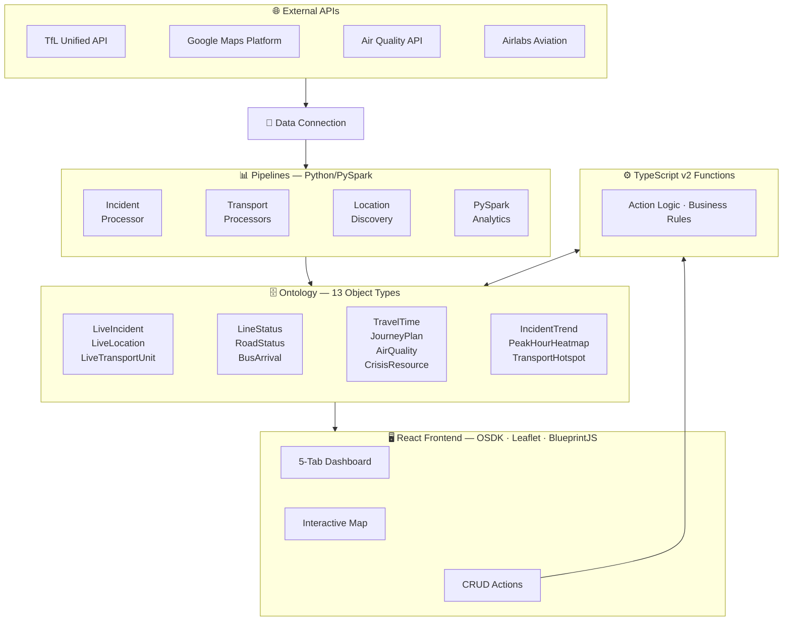

# 🚨 Crisis Logistics Command System

A full-stack real-time crisis logistics platform for West London, built on **Palantir Foundry**. Combines live data pipelines, PySpark analytics, ontology functions, and a React operational dashboard.

> ⚠️ **Note:** This system runs on [Palantir Foundry](https://www.palantir.com/platforms/foundry/) and requires a Foundry instance with the configured Ontology. Source code is provided for portfolio/review purposes.

## 📁 Repository Structure

| Directory | Stack | Description |
|-----------|-------|-------------|
| [`frontend/`](./frontend) | React 19, TypeScript 6, Vite 8, OSDK, Leaflet, BlueprintJS | Operational dashboard with 5 tabs, interactive map, filters, and CRUD actions |
| [`pipelines/`](./pipelines) | Python, PySpark, Foundry Transforms, REST APIs | Data ingestion + PySpark analytics (TfL, Google Maps, Airlabs, Air Quality APIs) |
| [`functions/`](./functions) | TypeScript v2, Foundry Functions | Server-side business logic and ontology edit functions |

## 🎥 Demo

[

## 🏗️ Architecture

## 📊 Data Pipeline (`pipelines/`)

20 Python transforms — 17 data ingestion + 3 PySpark analytics:

| Transform | Source | Output |
|-----------|--------|--------|
| `airlabs_processor` | Airlabs API | Aircraft/helicopter positions |
| `current_incidents` | TfL Unified API | Current incidents snapshot |
| `infrastructure_discovery` | Google Maps Places | LiveLocation objects |
| `route_directions` | Google Directions | Route data |
| `tfl_air_quality_processor` | TfL API | AirQuality objects |
| `tfl_bikepoints_processor` | TfL API | Bike docking stations |
| `tfl_bus_arrivals_processor` | TfL API | BusArrival objects |
| `tfl_incident_processor` | TfL Unified API | LiveIncident objects |
| `tfl_journey_planner_processor` | TfL API | JourneyPlan objects |
| `tfl_line_status_processor` | TfL API | LineStatus objects |
| `tfl_road_status_processor` | TfL API | RoadStatus objects |
| `tfl_stations_processor` | TfL API | Station data |
| `tfl_train_positions` | TfL API | Train positions |
| `tfl_vehicle_positions` | TfL API | Vehicle positions |
| `travel_time_matrix` | Google Distance Matrix | TravelTime objects |
| `unified_fleet` | Multiple sources | LiveTransportUnit objects |
| `unified_locations` | Multiple sources | Consolidated locations |
| ⚡ `incident_trend_analysis` | PySpark on raw_live_incidents | Daily trends + 7-day rolling avg |
| ⚡ `peak_hour_heatmap` | PySpark on raw_live_incidents | Hour × day disruption matrix |
| ⚡ `transport_reliability` | PySpark on raw_live_incidents | Geographic hotspot detection |

All API keys are stored securely in Foundry's secret vault — no hardcoded credentials.

## 🖥️ Frontend (`frontend/`)

React 19 operational dashboard with 5 tabs:

1. **Situation Overview** — Interactive Leaflet map with severity markers, histogram filters, time range
2. **Active Incidents** — Master-detail table with severity/type filters, mini-map flyTo
3. **Transport Status** — Disrupted lines, road conditions, bus arrivals with mode filters
4. **Resources & Fleet** — CRUD resource management via OSDK Actions, fleet monitoring
5. **Analytics** — Travel times, journey plans, air quality metrics + ⚡ PySpark-powered incident trends, peak hours, transport hotspots

**Tech:** React 19 · TypeScript 6 · Vite 8 · BlueprintJS 6 · Leaflet · @osdk/react

## ⚙️ Functions (`functions/`)

TypeScript v2 Foundry Functions providing server-side logic for:
- Ontology edit functions backing Action Types
- Data validation and business rules

## 🗄️ Ontology (13 Object Types)

| Object Type | Description |
|-------------|-------------|
| LiveIncident | Road/transport incidents with severity and geolocation |
| LiveLocation | Infrastructure points (hospitals, stations, police) |
| LiveTransportUnit | Fleet vehicles with GPS positions |
| LineStatus | Tube/rail/bus line disruption status |
| RoadStatus | Major road conditions |
| BusArrival | Real-time bus arrival predictions |
| CrisisResource | Inventory items (medical kits, water, blankets) |
| TravelTime | Travel times between hubs and incidents |
| JourneyPlan | Multi-modal route plans |
| AirQuality | Air quality forecasts |
| ⚡ IncidentTrend | Daily incident trends with 7-day rolling averages |
| ⚡ PeakHourHeatmap | Hour × day-of-week disruption frequency matrix |
| ⚡ TransportHotspot | Geographic hotspot detection with severity scoring |

## 📝 License

Proprietary, built for demonstration purposes.
