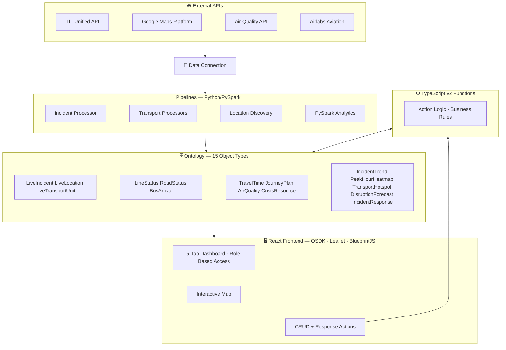

# 🚨 Crisis Logistics Command System

A full-stack real-time crisis logistics platform for West London, built on **Palantir Foundry**. Combines live data pipelines, PySpark analytics, ontology functions, and a React operational dashboard.

> ⚠️ **Note:** This system runs on [Palantir Foundry](https://www.palantir.com/platforms/foundry/) and requires a Foundry instance with the configured Ontology. Source code is provided for portfolio/review purposes.

> 💼 **Context:** Built as a prototype to pitch for contract work — real-time visibility into West London transport disruptions and incidents to coordinate field response and resource allocation. Designed around realistic operational personas (ops manager, dispatcher, resource officer, shift supervisor).

## 📁 Repository Structure

| Directory | Stack | Description |
|-----------|-------|-------------|
| [`frontend/`](./frontend) | React 19, TypeScript 6, Vite 8, OSDK, Leaflet, BlueprintJS | Operational dashboard with 5 tabs, role-based access, interactive map, filters, and CRUD actions |
| [`pipelines/`](./pipelines) | Python, PySpark, Foundry Transforms, REST APIs | Data ingestion + PySpark analytics (TfL, Google Maps, Airlabs, Air Quality APIs) |
| [`functions/`](./functions) | TypeScript v2, Foundry Functions | Server-side business logic and ontology edit functions |

## 🎥 Demo

https://github.com/user-attachments/assets/f7e2dc35-7809-4152-a712-232b144a301f

> **2-minute walkthrough** covering real-time incident monitoring, anomaly detection, transport disruption tracking, CRUD resource management, predictive forecasting, and role-based access.

## 🏗️ Architecture

## 📊 Data Pipeline (`pipelines/`)

22 Python transforms — 17 data ingestion + 5 PySpark analytics:

| Transform | Source | Output |
|-----------|--------|--------|
| `airlabs_processor` | Airlabs API | Aircraft/helicopter positions |
| `current_incidents` | TfL Unified API | Current incidents snapshot |
| `infrastructure_discovery` | Google Maps Places | LiveLocation objects |
| `route_directions` | Google Directions | Route data |
| `tfl_air_quality_processor` | TfL API | AirQuality objects |
| `tfl_bikepoints_processor` | TfL API | Bike docking stations |
| `tfl_bus_arrivals_processor` | TfL API | BusArrival objects |
| `tfl_incident_processor` | TfL Unified API | LiveIncident objects |
| `tfl_journey_planner_processor` | TfL API | JourneyPlan objects |
| `tfl_line_status_processor` | TfL API | LineStatus objects |
| `tfl_road_status_processor` | TfL API | RoadStatus objects |
| `tfl_stations_processor` | TfL API | Station data |
| `tfl_train_positions` | TfL API | Train positions |
| `tfl_vehicle_positions` | TfL API | Vehicle positions |
| `travel_time_matrix` | Google Distance Matrix | TravelTime objects |
| `unified_fleet` | Multiple sources | LiveTransportUnit objects |
| `unified_locations` | Multiple sources | Consolidated locations |
| ⚡ `incident_trend_analysis` | PySpark on raw_live_incidents | Daily trends + 7-day rolling avg |
| ⚡ `peak_hour_heatmap` | PySpark on raw_live_incidents | Hour × day disruption matrix |
| ⚡ `transport_reliability` | PySpark on raw_live_incidents | Geographic hotspot detection |
| ⚡ `anomaly_detection` | PySpark on raw_live_incidents | Z-score anomaly detection (SPIKE/DROP/NORMAL) |
| ⚡ `disruption_forecast` | PySpark on raw_live_incidents | Predicted high-risk windows (day × hour × zone) |

Data quality is enforced with Foundry Expectations (primary-key uniqueness, null checks) and unit tests. All API keys are stored securely in Foundry's secret vault — no hardcoded credentials.

## 🖥️ Frontend (`frontend/`)

React 19 operational dashboard with **role-based tab visibility** (All Access, Ops Manager, Dispatcher, Resource Officer, Shift Supervisor) and 5 tabs:

1. **Situation Overview** — Interactive Leaflet map with severity markers, histogram filters, time range, anomaly alert banner, and low-stock alert banner
2. **Active Incidents** — Master-detail table with severity/type filters, mini-map flyTo, CSV export, and incident response workflow (acknowledge / reroute / escalate) with full response history
3. **Transport Status** — Disrupted lines, road conditions, bus arrivals with mode filters
4. **Resources & Fleet** — CRUD resource management via OSDK Actions, threshold alerts, fleet monitoring, toast notifications
5. **Analytics** — Travel times + ⚡ PySpark-powered intelligence: weekly disruption forecast, incident trends, peak disruption hours, geographic hotspots (line, bar, horizontal bar charts)

**Tech:** React 19 · TypeScript 6 · Vite 8 · BlueprintJS 6 · Leaflet · Recharts · @osdk/react

**Features:** Role-based access · Anomaly detection · Predictive forecasting · Auto-refresh (15min countdown) · CSV export · Browser notifications · Loading skeletons · Toast notifications · Per-section error boundaries · Live pulse indicator · Numbered pagination with page-size control · "Add filters" popover

## ⚙️ Functions (`functions/`)

TypeScript v2 Foundry Functions providing server-side logic:
- `isBelowThreshold` — flags resources below their critical threshold
- `countLowResources` — counts resources needing restock
- Function-backed columns for at-a-glance operational status

## 🗄️ Ontology (15 Object Types)

| Object Type | Description |
|-------------|-------------|
| LiveIncident | Road/transport incidents with severity and geolocation |
| LiveLocation | Infrastructure points (hospitals, stations, police) |
| LiveTransportUnit | Fleet vehicles with GPS positions |
| LineStatus | Tube/rail/bus line disruption status |
| RoadStatus | Major road conditions |
| BusArrival | Real-time bus arrival predictions |
| CrisisResource | Inventory items (medical kits, water, blankets) |
| TravelTime | Travel times between hubs and incidents |
| JourneyPlan | Multi-modal route plans |
| AirQuality | Air quality forecasts |
| ⚡ IncidentTrend | Daily incident trends with 7-day rolling averages |
| ⚡ PeakHourHeatmap | Hour × day-of-week disruption frequency matrix |
| ⚡ TransportHotspot | Geographic hotspot detection with severity scoring |
| ⚡ DisruptionForecast | Predicted high-risk windows by day, hour, and zone |
| IncidentResponse | Operational response audit trail (acknowledge / reroute / escalate) |

## 📝 License

Portfolio/demonstration project. Source shared for review purposes.
